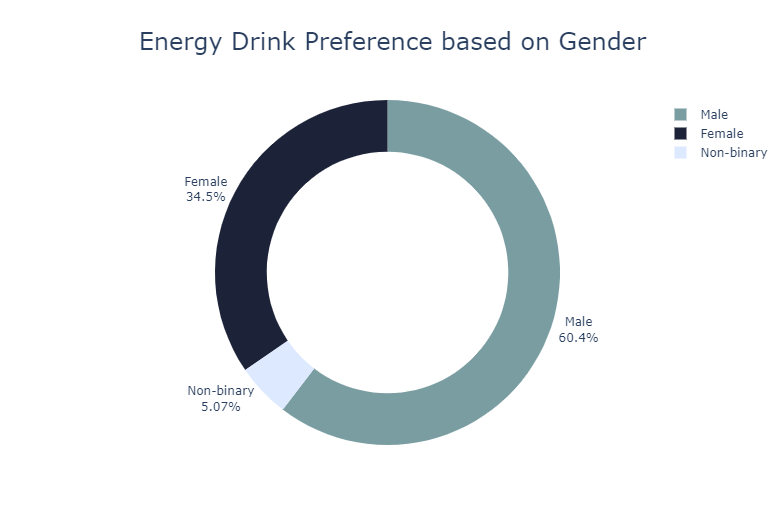
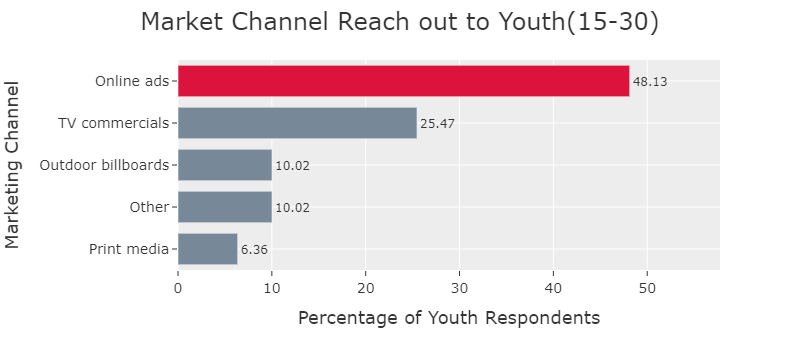
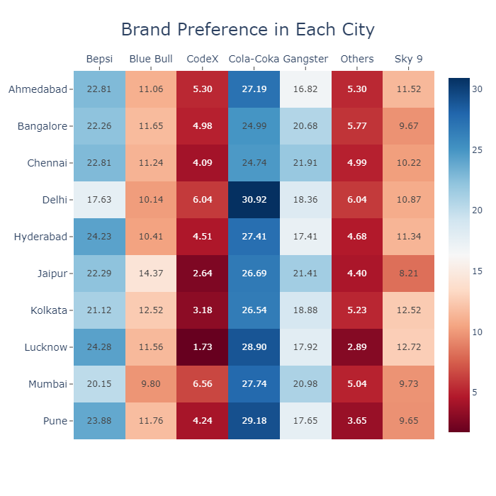

# MarketingInsightsFoodnBeverage  

**Domain:** F & B   
**Function:** Marketing  

**CodeX** is a German beverage company that is aiming to make its mark in the Indian market. A few months ago, they launched their energy drink in 10 cities in India. Their Marketing team is responsible for increasing
brand awareness,
market share,
product development.
Survey was conducted in 10 cities and received results from 10k respondents.
As a marketing data analyst we are tasked to convert these survey results to meaningful insights which the team can use to drive actions.  

Check here [https://kvrkarthik.com/marketing-insights-of-codex/] for the blog.

Check the link for rendered plotly images: https://nbviewer.org/github/karthik-44/MarketingInsightsFoodnBeverage/blob/main/MarketAnalysis.ipynb    

## Context
CodeX is a company from Germany that makes drinks. They want to make their mark in India too. They started selling their energy drink in 10 Indian cities. They did a survey in these cities to find out if people like their brand. They got 10,000 responses to their survey questions.

## Problem Statement
As a Marketing Data Analyst the task is to convert these survey results to meaningful insights which can help the team with data driven business decisions.

Responsible for analysing and increasing:

- Brand awareness.
- Market share.
- Product development.
- Insights to be communicated to the CEO of the company.

## Data

The data obtained is from three files:  
- **City**: Details about the city.
- **Respondents**: Demographic details of the respondents.
- **Survey Responses**: Responses from the participants for the marketing survey questions.

After combining these our data has **10000** rows, **29** columns.

- Response_ID
- Consume_frequency
- Consume_time
- Consume_reason
- Heard_before
- Brand_perception
- General_perception
- Tried_before
- Taste_experience
- Reasons_preventing_trying
- Current_brands
- Reasons_for_choosing_brands
- Improvements_desired
- Ingredients_expected
- Health_concerns
- Interest_in_natural_or_organic
- Marketing_channels
- Packaging_preference
- Limited_edition_packaging
- Price_range
- Purchase_location
- Typical_consumption_situations

A sample of the survey questionnaire can be found [here](./Survey_Questions_and_Response_Options.pdf) .  

### Data Cleaning
A bit of data cleaning is necessary while doing analysis related to our brand. The reason for this is:

**For brand, logo, design**:
We should not consider the responses where people told that they haven’t heard about our brand but they prefer us.
Because they might not be aware of the design and logo.

**For product taste experience**:
We should consider the responses of people who have heard about us and tasted the product.
Because the responses from the people who haven’t tasted the product doesn’t make sense. For example, the rating given by someone who didn’t taste our energy drink doesn’t make sense as they might give just 1 or even high 5.

**For preference**:
For this we need to avoid the responses where people prefer our brand but have not heard about us
Because to improve our product we need to identity the responses where people who actually know us.

## Analysis  
The analysis is done in the following order:

- Data Hierarchy
- Present Situation
- Demographic Insights
- Consumer Preference
- Competitors
- Marketing Channels
- Brand Penetration
- Purchase Behavior
- Product Development

## Data Hierarchy

  

**Tier 1**:
Bangalore, Chennai, Delhi, Hyderabad, Mumbai

**Tier 2**:
Ahmedabad, Jaipur, Kolkata, Lucknow, Pune.

**Major Brands**:
Cola-Coka, Bepsi, Gangster, Blue Bull, CodeX, Sky9

## Current Situation

  
  
From this chart we can see that we are in the 5th position and less than 10% of people prefer our drink.

## Demographic Insights
### Gender based

  

From this chart, we can see that all sections of gender have a preference for energy drink.
We have a sample of data where Males are in higher proportion who prefers to have energy drink.

### Age based

  

This plot suggests that energy drinks are popular in the age group of 19-30.
After that the energy drink preference reduces.
Youth (15-30) preference is higher.

### Popular Marketing Channel in Youth

  

As the data suggests, the best way to reach out is through Online ads followed by TV Commercials.

## Consumer Preference
### Based on Ingredients

  

This plot suggests that Caffeine and Vitamins are important ingredients and lots of people prefer to have organic ingredients with reduced sugar content.

### Based on Packaging

  

This chart suggests Compact and portable cans are preferred better. This makes sense assuming youth and adults are busy with their colleges, work, gym, drive and prefer to have a handy design.

Limited Edition packaging might not a important contributing factor at present for the product development, but once we have a better product it can help. Lots of respondents didn’t consider Eco-friendly design (but its better to have this) along with the above.

## Competitors
### Major Competitors

  

Cola-Coka and Bepsi are the leaders in terms of people’s preference.
Let us see why people prefer them.

### Customer Reasons for choosing

  

Brand reputation and Taste/flavor preference are the top reasons people choose them.
This suggests improvement in the product taste is necessary.

## Marketing Channels

  

The digital media – Online ads and TV Commercials are top advertising channels.
In terms of marketing we are following the trend.

## Brand Penetration
### Brand logo, design

  

From this chart, majority are neutral to our brand.
It is clear that we have to improve the brand logo, design as it is one of the major factor for the product.

### Product taste experience

In this star based rating system, values of 1, 2, 3, 4, 5 means poor, below average, average, good, excellent respectively.

  

We have lot of 3 star ratings, a good number of 4 and 5 star ratings as well.
We should focus on increasing the taste quality of the product.

### CodeX preference in each city

  

This heatmap represents in each city how the people prefer a particular brand.
A higher shade of blue means the preference is better.
A higher shade of red indicates the preference is lower.
This suggests, we have to improve our product and we should focus of improvement should be more in Lucknow, Jaipur, Kolkata.

## Purchase Behavior

  

This chart suggests that many people purchases energy drinks at supermarkets and top consumption situations are sports/exercise, to stay awake or focused.
So we have to ensure our product’s availability at not only supermarkets but also at gyms and fitness centers.
It is good to see that people are willing to pay more for the product that they think is better.

## Product Development 
- The immediate improvements would be to improve the taste of the product, then improve the branding name, logo or design.
- Once the above have been done we can focus to increase the availability of the product.
- Regarding price we can start in the higher end of 50-99 range and once we are getting proper sales in most places we can raise the price to 100-150 range as people are willing to spend in that range.
- Another strategy would be to change the price of the product depending on the demand and location of the product.
- Once we improve upon our product taste we can give either BOGO offers, at least we have to try that in the cities where the performance is too bad (Lucknow, Jaipur).
- Our major target group should be people who belongs to age group of 15 to 30, because as per our survey many people who responded belongs to this category who feel its not Dangerous to consume the energy drinks.
- For choosing a brand ambassador for the product, a sports athlete who is admired by the youth age group will be a better option as per the survey analysis.

